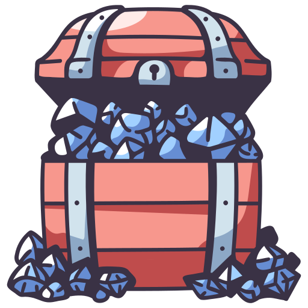

    </img>

# SiO2 - Quartz

quartz comes in many varieties, colors, crystalline structures. So do your apps! This is an adaptation of the popular `vitesse` starter-kit that leverages many state of the art plugins and advancements in the vue ecosystem.

## Purpose

The objective of this starter kit is to integrate further advances in design system thinking and modern css along with some automations to kick off new designs in a hurry while not sacrificing integrity. 

Unocss (and utility engines/frameworks) is great, but using them alone incurs certain amount of technical debt.

Follow Andy Bell and others to learn about intrinsic design that scales to all platforms. This is hard to do with utilities alone and requires some more intentional approaches. 

These approaches, such as CUBE methodology, are baked into this kit. 

## Definitions

CUBE is applied by integrating the composition into pre-defined `.vue`. sfc's and blocks map nicely to components. 

## Tasks
- build block implementations as vue sfc's (eg sidebar, grid, stack etc.)
- further leverage Unocss to build out useful atomic styles
- build sample layouts and pages showcasing the CUBE usages

---

    </img>

# TokeniZr 

This is an off the wall idea I had while building out Quartz using design tokens. The flow of information in a design is typically as follows: 

`Designer establishes design tokens -> Design Tokens determine atomic styles -> atomic styles proliferate through front end implementation`

TokeniZr's goal is to complete the cycle of iteration, specifically for use cases where the developer is also the designer (prototyping) or when the design is not fully established and you want to quickly ideate and explore various style options using the existing design. 

TokeniZr is a cli tool/simple http server backend that recieves https requests from a universal vue component that gets inserted into the client along with the current design. This component is only for modifying the design tokens JSON via interface and is compiled out during build. 

Now we can update the design tokens in real time and thus: 

`Developer updates design tokens === Designer establishes Design tokens -> Design tokens determine atomic styles -> ...`

